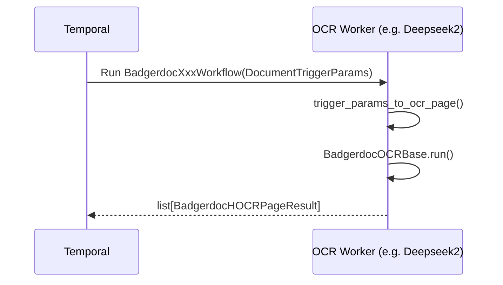
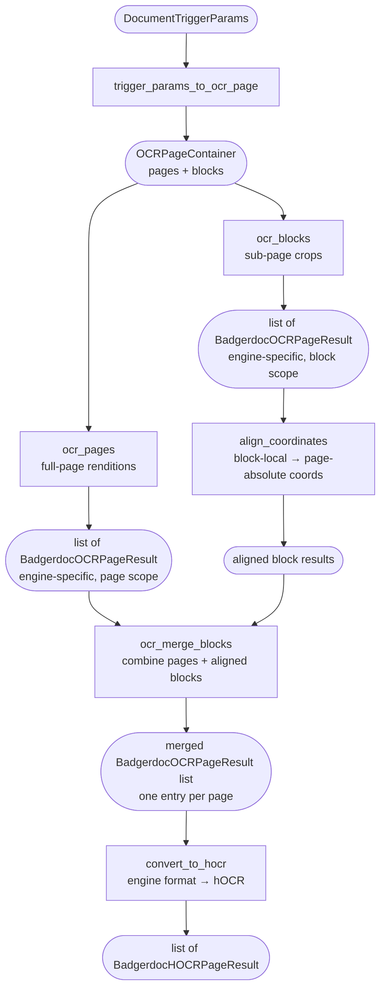
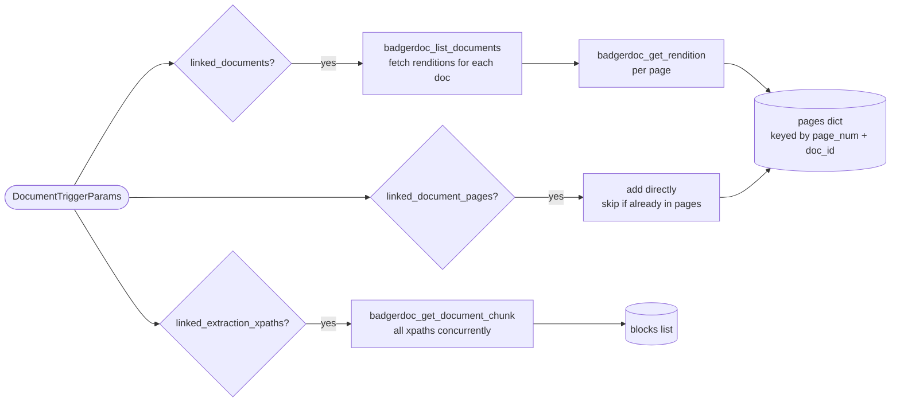
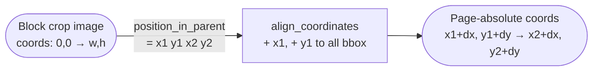

# Badgerdoc OCR

This page describes how the Badgerdoc OCR subsystem works internally and provides a step-by-step guide for adding a new OCR engine.

---

## Overview

Badgerdoc OCR converts document rendition images into structured hOCR extraction results that can be reviewed in the workspace UI. Each OCR engine runs as an independent Temporal worker and implements a shared abstract base class (`BadgerdocOCRBase`) defined in `badgerdoc_common`.

---

## High-level Architecture



---

## Internal OCR Pipeline

Every OCR worker delegates its logic to a class that extends `BadgerdocOCRBase`.
`run()` is the orchestration entry point — it calls the five abstract methods in order:



### Step-by-step description

| Step | Method | Input | Output | Notes |
|---|---|---|---|---|
| 1 | `trigger_params_to_ocr_page` | `DocumentTriggerParams` | `OCRPageContainer` | Resolves linked docs, pages, and xpath blocks into concrete image references. Calls `badgerdoc_list_documents`, `badgerdoc_get_rendition`, `badgerdoc_get_document_chunk` as Temporal activities. |
| 2 | `ocr_pages` | `list[OCRPageRequest]` | `list[BadgerdocOCRPageResult]` | Runs OCR on full-page rendition images. Engine-specific raw output. |
| 3 | `ocr_blocks` | `list[OCRPageRequest]` | `list[BadgerdocOCRPageResult]` | Runs OCR on sub-page block crops. Must preserve input order and insert empty results for failures. |
| 4 | `align_coordinates` | `OCRPageRequest` + `BadgerdocOCRPageResult` | `BadgerdocOCRPageResult` | Shifts block-local bounding boxes by the crop origin `(x1, y1)` from `metadata["position_in_parent"]` so coordinates are page-absolute. Called once per block. |
| 5 | `ocr_merge_blocks` | `pages` + `blocks` (both `list[BadgerdocOCRPageResult]`) | `list[BadgerdocOCRPageResult]` | Folds all block results belonging to the same page into one entry. Returns one result per page. |
| 6 | `convert_to_hocr` | `list[BadgerdocOCRPageResult]` | `list[BadgerdocHOCRPageResult]` | Converts engine-specific internal output to the normalised hOCR format that Badgerdoc stores as `ExtractionPage` records. |

---

## Key Data Types

### `OCRPageRequest`
A single image reference passed to an OCR method.

```python
@dataclass
class OCRPageRequest:
    badgerdoc_document: BadgerdocDocumentPage  # document + page_num
```

### `OCRPageContainer`
The resolved scope of an OCR job, produced by `trigger_params_to_ocr_page`.

```python
@dataclass
class OCRPageContainer:
    pages: list[OCRPageRequest]   # full-page renditions
    blocks: list[OCRPageRequest]  # sub-page crops (from xpath references)
```

### `BadgerdocOCRPageResult`
Internal, engine-specific OCR output. Lives only within a worker.

```python
@dataclass
class BadgerdocOCRPageResult:
    ocr: dict[PAGE_NUM, list[OCR_PATH]]  # page → list of output file paths
```

### `BadgerdocHOCRPageResult`
Normalised hOCR output shared with Badgerdoc. See [Extraction Formats](extraction_formats.md) for the hOCR spec.

```python
@dataclass
class BadgerdocHOCRPageResult:
    h_ocr: dict[PAGE_NUM, HOCR_PATH]  # page → path to hOCR file
```

---

## How `trigger_params_to_ocr_page` Resolves Inputs

`DocumentTriggerParams` can carry three kinds of references. They are resolved in this order:



- **Duplicates**: a page already resolved from `linked_documents` will be skipped from `linked_document_pages` with a warning.
- **Block crops**: each chunk document stores `metadata["position_in_parent"] = "x1 y1 x2 y2"` which is later used by `align_coordinates`.

---

## How to Add a New OCR Worker

### 1. Create a new `uv` package

Follow the layout of an existing worker, e.g. `workflows/badgerdoc_ocr_deepseek_2`:

```
workflows/
  badgerdoc_ocr_your_engine/
    badgerdoc_ocr_your_engine/
      __init__.py
      workflow.py          # Temporal @workflow.defn
      your_engine_ocr.py   # BadgerdocOCRBase subclass
      activities/
        ocr_requests.py    # @activity.defn functions
        ocr_convertors.py  # @activity.defn functions
    main.py
    pyproject.toml
    Dockerfile
```

Declare `badgerdoc_common` as a local path dependency in `pyproject.toml`:

```toml
[tool.uv.sources]
badgerdoc_common = { path = "../badgerdoc_common", editable = true }
```

### 2. Implement `BadgerdocOCRBase`

Create `your_engine_ocr.py` and implement all five abstract methods:

```python
from badgerdoc_common import hocr, trigger
from badgerdoc_common.badgerdoc_ocr import BadgerdocOCRBase, OCRPageRequest

class YourEngineOCR(BadgerdocOCRBase):

    async def ocr_pages(
        self,
        params: trigger.DocumentTriggerParams,
        pages: list[OCRPageRequest],
    ) -> list[hocr.BadgerdocOCRPageResult]:
        # Run your OCR engine on each full-page rendition image.
        # Return results in the same order as `pages`.
        # Insert BadgerdocOCRPageResult(ocr={}) for any failed page.
        ...

    async def ocr_blocks(
        self,
        params: trigger.DocumentTriggerParams,
        blocks: list[OCRPageRequest],
    ) -> list[hocr.BadgerdocOCRPageResult]:
        # Run your OCR engine on each sub-page block crop.
        # MUST preserve order and insert empty result for failures.
        ...

    async def align_coordinates(
        self,
        params: trigger.DocumentTriggerParams,
        block: OCRPageRequest,
        result: hocr.BadgerdocOCRPageResult,
    ) -> hocr.BadgerdocOCRPageResult:
        # Read block.badgerdoc_document.document.metadata["position_in_parent"]
        # which is "x1 y1 x2 y2". Shift all bounding boxes in result by (x1, y1).
        ...

    async def ocr_merge_blocks(
        self,
        pages: list[hocr.BadgerdocOCRPageResult],
        blocks: list[hocr.BadgerdocOCRPageResult],
    ) -> list[hocr.BadgerdocOCRPageResult]:
        # Merge block results into page results by page key.
        # Return one BadgerdocOCRPageResult per page.
        ...

    async def convert_to_hocr(
        self,
        params: trigger.DocumentTriggerParams,
        results: list[hocr.BadgerdocOCRPageResult],
    ) -> list[hocr.BadgerdocHOCRPageResult]:
        # Convert your engine's internal format to hOCR files.
        # See Extraction Formats docs for the hOCR spec.
        # Return one BadgerdocHOCRPageResult per page.
        ...
```

### 3. Create the Temporal workflow

`workflow.py` should call `trigger_params_to_ocr_page` then delegate to your class:

```python
from temporalio import workflow
from badgerdoc_common import trigger
from badgerdoc_common.badgerdoc_ocr import trigger_params_to_ocr_page
from badgerdoc_common.hocr import BadgerdocHOCRPageResult
from badgerdoc_ocr_your_engine.your_engine_ocr import YourEngineOCR

@workflow.defn
class YourEngineWorkflow:

    @workflow.run
    async def run(
        self, params: trigger.DocumentTriggerParams
    ) -> BadgerdocHOCRPageResult:
        ocr_container = await trigger_params_to_ocr_page(params)
        hocr_results = await YourEngineOCR().run(params, ocr_container)
        # combine into a single BadgerdocHOCRPageResult for the lifecycle worker
        combined: dict = {}
        for result in hocr_results:
            combined.update(result.h_ocr)
        return BadgerdocHOCRPageResult(h_ocr=combined)
```

### 4. Register activities in `main.py`

Register both your own activities **and** the `badgerdoc_common` document activities that `trigger_params_to_ocr_page` dispatches:

```python
from badgerdoc_common.activities.document import (
    badgerdoc_get_document_chunk,
    badgerdoc_get_rendition,
    badgerdoc_list_documents,
)

Worker(
    client,
    task_queue="badgerdoc_ocr_your_engine",
    workflows=[YourEngineWorkflow],
    activities=[
        your_ocr_activity,
        your_convertor_activity,
        # required by trigger_params_to_ocr_page:
        badgerdoc_list_documents,
        badgerdoc_get_rendition,
        badgerdoc_get_document_chunk,
    ],
)
```

> **Important:** if you forget to register the `badgerdoc_common` document activities, Temporal will raise `NotFoundError` at runtime when the workflow tries to resolve document references.

### 5. Add a `WorkflowRegistry` record

Create a `WorkflowRegistry` database entry (via Django admin or fixture) pointing to your new worker:

| Field | Value |
|---|---|
| `name` | `Your Engine OCR` |
| `temporal_workflow_type` | `YourEngineWorkflow` |
| `temporal_queue` | `badgerdoc_ocr_your_engine` |
| `trigger` | `manual` |
| `extraction_scope` | `["page"]` or `["page", "block"]` |
| `is_active` | `true` |

### 6. Add a `Dockerfile` and register in `docker-compose.yml`

Copy an existing worker `Dockerfile` (e.g. `badgerdoc_ocr_deepseek_2`) and update the package name. Add a service entry in `docker-compose.yml` with the correct `task_queue` environment variable.

---

## Coordinate Alignment for Block OCR

When OCR runs on a block crop, all bounding-box coordinates are relative to the top-left corner of that crop image. Before block results can be merged with full-page results, they must be shifted into page-absolute space.



The crop position is stored in the chunk document's metadata:

```json
{ "position_in_parent": "120 340 480 620" }
```

This means the crop starts at `(120, 340)` in the parent page. `align_coordinates` must add `120` to every x-coordinate and `340` to every y-coordinate in the result.

---

## Ordering Contract for `ocr_blocks`

`align_coordinates` pairs each `OCRPageRequest` from `OCRPageContainer.blocks` with its corresponding `BadgerdocOCRPageResult` by index using `zip`. This means `ocr_blocks` **must** return results in the same order as its input list.

```
blocks input:   [block_A, block_B, block_C]
ocr_blocks:     [result_A, result_B, result_C]  ✓
                [result_A, result_C]             ✗ misalignment — result_C paired with block_B
```

If a block fails, insert `BadgerdocOCRPageResult(ocr={})` at that position.
